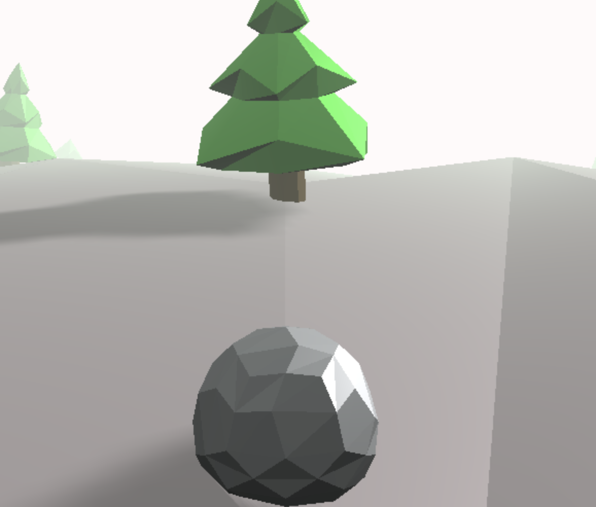

# Rock Roller

A pure HTML5 game ([source](https://github.com/juwalbose/ThreeJSEndlessRunner3D)) that can be streamed on SAS Viya, EBI, and [SASjs Server](https://server.sasjs.io).

The purpose is to demonstrate the ease with which HTML5 apps can be compiled, built and deployed using SASjs.

## Deployment

If you just want to deploy the game in your SAS environment, in all cases you need to download the relevant asset from the [releases](https://github.com/sasjs/rockroller/releases) page.

* SAS 9 - Open `sas9.sas` in Enterprise Guide or Studio.  Modify line 2 with your preferred appLoc.  Execute and open the link at the end of the log.
* Viya - Open `viya.sas` in SAS Studio. Execute and open the link at the end of the log.
* SASjs Server - just import the `server.json.zip` file to AppStream

That's it!  Nothing to install, and no admin rights or special privileges required.

## Build

If you are a developer and would like to build the app from source, you first need to [install](https://cli.sasjs.io/installation) the SASjs CLI.

Then, update the `defaultTarget` attribute of the `sasjs/sasjsconfig.json` according to whether you are running SASjs `server`, `sas9` EBI, or `viya`.  You should also update the `serverUrl` and `appLoc` attributes of the relevant target, to determine to which server and logical folder you will deploy.

Instructions thereafter:

1.  Run `npm install` to obtain the dependencies
2.  Run `sasjs auth` to authenticate against your chosen target
3.  Run `sasjs cbd` to compile, build & deploy your local app to your SAS target

Finally, click the link at the bottom of the console to launch!

For questions or support:

* [SASjs Matrix Channel](https://matrix.to/#/%23sasjs:4gl.io)
* [Contact 4GL Apps](https://sasapps.io/contact)
* [Github Discussions](https://github.com/orgs/sasjs/discussions)
